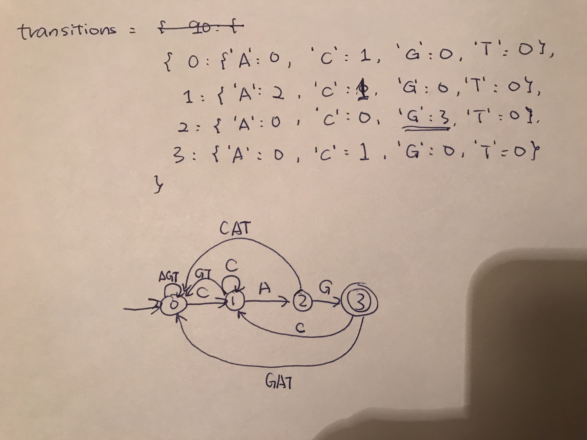

This program is written in Python3. To run this program, make sure that you put a file named `chromosome.txt` in the same folder as the `huntington.py` file, and use the following command in the terminal:

```bash
python3 huntington.py
```

A sample output (`positive3.txt`) of the program looks like this:

```bash
Current index: 218, Progress: [------------------->] 100 %
Huntington's score: 56
POSITIVE
```

When the program is running, `Current index` indicates the index of the character that we're processing, starting from 0, and the progress is the percentage of the characters we processed.

When the program is finished, the Huntington's score will be displayed, and if the score is greater or equal to 40, the result will be `POSITIVE`, otherwise `NEGATIVE`.

The transitions of the DFA used in the program is implemented using a dictionary of dictionaries. The data structure and the DFA is shown below:



The Huntington's score is counted in the following way in my program:

Whenever the state of the machine reaches 3, which means we reached the 'G' in a 'CAG', we compare the current index to the index of 'G' in the last 'CAG'. If the difference is 3, which means they're in succession, we add 1 to the Huntington's score, and update the `indexOfLastState3`. Otherwise we simply update `indexOfLastState3`.

Also, the program does input validation in the beginning. A valid input should has length that's multiple of three, and only contains 'A', 'C', 'G' and 'T' in the sequence.